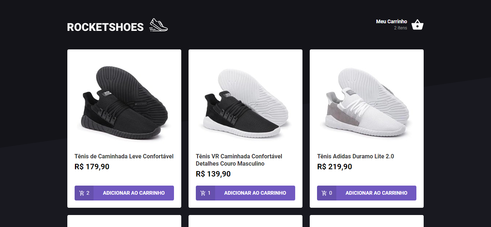
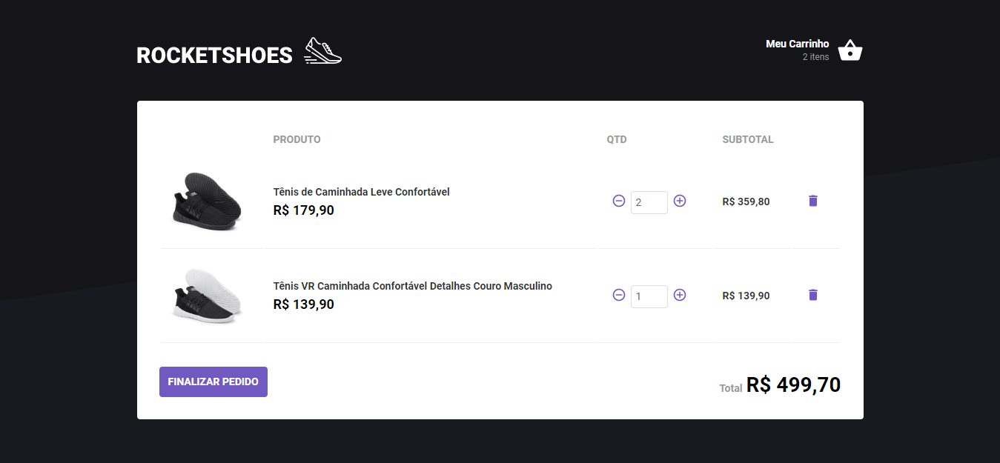

# 👞 RocketShoes

Simples e-commerce que lista produtos e permite adicionar ao carrinho. Foi desenvolvido utilizando [React](https://pt-br.reactjs.org/) e [Redux](https://redux.js.org/).

### [Live Demo](https://guihenrry-rocketshoes.netlify.com/)





## :information_source: Como utilizar em 4 passos

```bash
# Clone o repositório
$ git clone https://github.com/Guihenrry/rocketshoes.git

# Entre na pasta do repositório
$ cd rocketshoes

# Instalar dependencias
$ yarn

# Execute o projeto
$ yarn start
```

Feito com ♥ by Gui Henrry ✌
